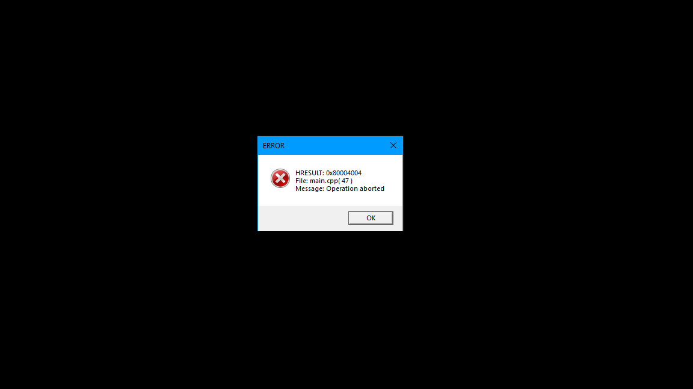

# DXErr

*In this blog we are going to discuss dxerr lib and it's alternative*

June 15, 2025


We will be following **Introduction to Computer Graphics using DirectX11 by Frank luna** book. In this book they have used `dxerr` lib for handling HREUSLT output from Direct3D functions. Its is a practicle tool for tracking down the couse of errors and handling them. The main feature being that it can translate the error code into a string message. In the past one could directly used `dxerr` but now Windows has decided to discontinue it. Below is an alternative that I will be using. 

In order to get the message from the HRESULT we will be using `FormatMessageA`. Below is the implemenatation of it. 

```cpp
#include <iostream>
#include <windows.h>
#include <string>
#include <sstream>

#ifdef _DEBUG
#define HR(x) dxerr(x, __FILE__, __LINE__)
#else
#define HR(x) (x)
#endif

void dxerr(HRESULT hr, const char *file, int line)
{
    LPSTR buffer = nullptr;
    FormatMessageA(
        FORMAT_MESSAGE_ALLOCATE_BUFFER |
            FORMAT_MESSAGE_FROM_SYSTEM |
            FORMAT_MESSAGE_IGNORE_INSERTS,
        nullptr, hr,
        MAKELANGID(LANG_NEUTRAL, SUBLANG_DEFAULT),
        (LPSTR)&buffer,
        0, nullptr);

    std::ostringstream oss;
    oss << "HRESULT: 0x" << std::hex << hr << std::dec << std::endl;
    oss << "File: " << file << "( " << line << " )" << std::endl;

    if (buffer)
    {
        oss << "Message: " << buffer;
    }
    else
    {
        oss << "Message: Unkown Error";
    }

    MessageBoxA(0, oss.str().c_str(), "ERROR", MB_OK | MB_ICONERROR);
}

int WinMain(
    HINSTANCE hInstance,
    HINSTANCE hPrevInstance,
    LPSTR lpCmdLine,
    int nShowCmd)
{
    HRESULT hr = E_ABORT;
    HR(hr);

    return (0);
}
```

The test results are as follows:



